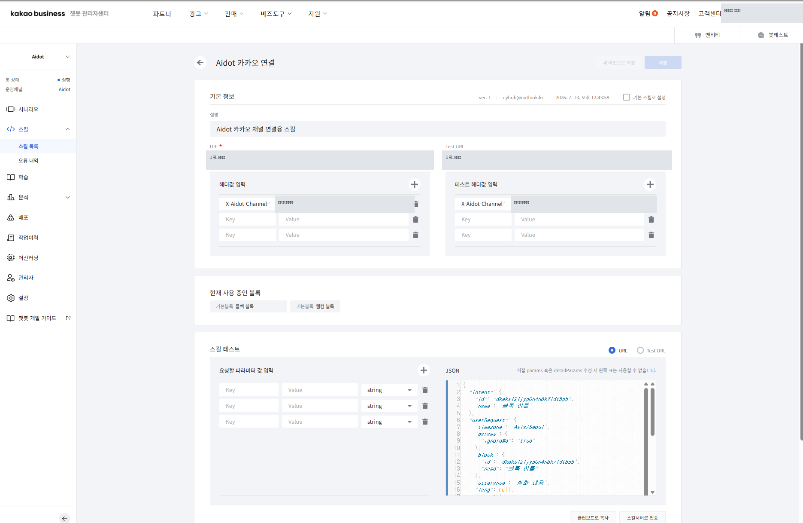
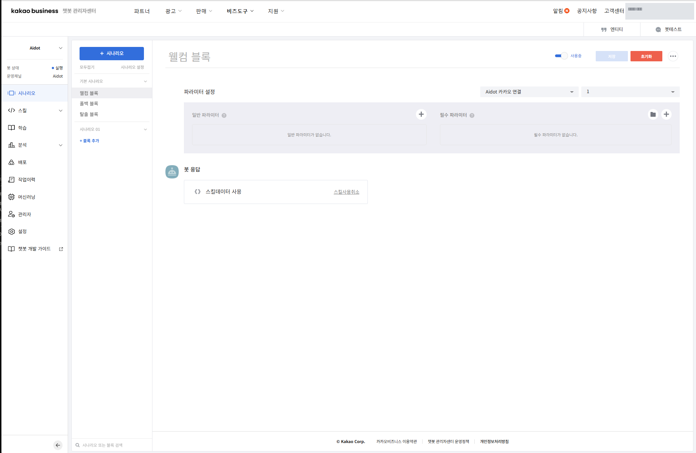
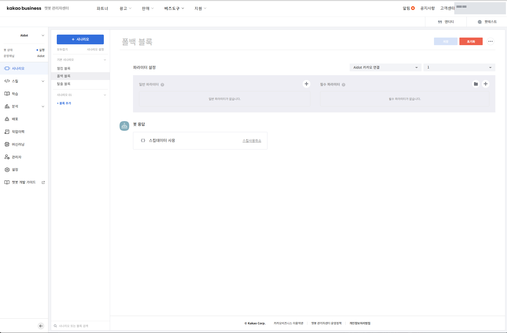

# CGA Studio ユーザーマニュアル

ターゲット：一般ユーザー、ボットオペレーター、システム管理者

このドキュメントでは、CGA Studioのメニューとワークフローについて説明します。初めて使用する場合は、[CGA Getting Started](../cga-getting-started/README.md)を先に読んで、エンジン選択・学習・品質改善については[CGA NLU活用ガイド](../cga-nlu-guide/README.md)を参照してください。

## 1. CGA Studioを始めよう

### 1.1 ログイン

1. CGA Studioログイン画面を開きます。
2. アカウント情報を入力してください。
3. ログイン後、CGA Studio画面に移動します。

### 1.2 ドキュメントで使用する表記

- `ボット`: 会話サービスを提供する単位
- `バージョン`: ボットの設定と学習資産を管理する実行単位
- `NLU方式`: ユーザーの発話を意図や意味で解釈する方法
- `応答方式`: 分類結果に基づいて回答を生成または検索する方法
- `学習`: ML または選択した実行エンジンに合わせてボットのデータを反映するタスク

### 1.3 画面でステータスを確認する

ボット作成画面では、入力領域とともに現在の選択を要約する領域が表示されます。次の項目を最初に確認してください。

- 言語
- NLU方式
- NLUモデル
- 回答方法
- LLM Provider またはモデル
- バージョン

NLU 方式または回答方式を変更すると、選択可能なモデルと追加の設定項目が異なる場合があります。画面の組み合わせ状態が`実行・学習可能`であるか、`設定の保存のみ可能`であるかを確認してから、次の操作を決定します。初めて使用する場合は、組み合わせ状態を確認せずに`確認`を選択しません。

生成画面で、`確認`は入力した設定を送信する動作であり、`キャンセル`は生成画面を終了する動作です。提出以降、ボット生成結果と学習・インデックス作成完了状態は別途の実行検証対象です。

## 2. ボット作成とAI設定

ボット作成画面では、ボット基本情報とAI関連設定を一緒に指定します。

### 2.1 基本情報

現在の画面で確認される基本項目は次のとおりです。

- ボットタイプ: ボット、ボットハブ
- ボットモード：テキスト型、ボイス型
- ボットプロフィール
- ボット名
- 言語：現在の画面オプションは韓国語
- はじめに

ボット名は、画面の指示に従って許可された文字と長さを守って入力します。プロファイル画像は、PNG、JPEG、WEBP形式と画面に表示される容量制限を確認します。

### 2.2 NLU方式

現在のCGA画面で選択可能なNLU方式は次のとおりです。

|画面表示|意味|
|---|---|
| ML |学習文と意図を中心に分類する方法
| Semantic - Vector Worker | CGAのVector WorkerとVector DBを使用したSemantic方式
| Semantic - External Embedding |外部埋め込みとLocal Vector DBを結ぶSemantic方式
| LLMエンジン| LLMモデルの使用方法|

エンジン固有の選択基準とデータの準備方法については、[NLU活用ガイドのエンジン比較](../cga-nlu-guide/engine-comparison.md)を参照してください。

### 2.3 NLUモデル

NLU 方式によってモデルのリストが異なります。

- ML: DeepLearning Lite, TF-IDF Linear, Keyword Baseline
- Semantic: 基本 Vector Worker モデルまたは外部埋め込みモデル
- LLM: Provider の選択と Provider 固有の詳細モデルの選択

LLM画面では、Gemini、ChatGPT、Claude、Groq、Cerebras、Mistral、Ollama、OpenRouterなどのProviderが表示され、選択したProviderによって詳細モデルのリストが異なります。実際に利用可能なモデルと接続状態は、生成画面の選択可能状態に基づいて確認されます。

### 2.4 回答方法

現在の画面で確認される回答方法は次のとおりです。

- 決まった回答
- Semantic Engine RAGの回答
- LLM Engine RAGの回答
- LLM Engineの回答

NLU方式と回答方式の組み合わせにはサポート状況が表示されることがあります。組み合わせ状態が無効になっている場合は、ランダムに進むのではなく、サポートされている組み合わせに変更してください。

## 3. ボットバージョンとワークスペース

ボットを作成したら、ボットとバージョンを区別して管理します。

- ボット: サービスユニットの基本情報と運営対象
- バージョン：意図・個体・事前・対話設計・AI設定をまとめて管理する単位
- 作業領域: 特定ボットバージョンの設計・テスト・分析を行う画面

詳細パスは、現在のCGA画面のメニュー名に基づいて確認します。

操作を開始するときは、まずボットとバージョンを選択し、画面に表示されているターゲットが意図したターゲットであることを確認してください。他のボットやバージョンが選択された状態でデータを変更すると、結果が異なる場合があります。

### 3.1 主なアクセス経路

|仕事|アクセスパス|
|---|---|
|ボットリスト| Studio>ボット|
|新しいボットの作成| Studio > ボット > ボットの作成 |
|ボット設定|選択したボット>設定|
|バージョン一覧|選択したボット>バージョン管理|
|バージョンワークスペース|選択したボット>バージョン>ワークスペース|

画面のボット・バージョン選択状態を先に確認し、意図、オブジェクト、辞書、QAなどのバージョン資産を修正します。

## 4. 会話設計資産

### 4.1 意図

ユーザーの発話が何を要求するかを区別する単位。意図的な学習文に関連付けられている会話の流れを一緒に確認する必要があります。

アクセスパスは `ボット > バージョン > 意図` です。意図データを修正したら、そのバージョンの学習状態とシミュレータの結果を一緒に確認します。

### 4.2 オブジェクト

発話から業務処理に必要な値や名称を抽出する単位です。オブジェクトを変更するときは、関連付けられた意図と会話フローが使用されているかどうかを確認します。

アクセスパスは `ボット > バージョン > エンティティ` です。オブジェクト名または抽出基準を変更するときは、既存の意図とテスト発火が引き続き有効であることを確認してください。

### 4.3 辞書

ドメイン用語、同義語、ユーザー表現を解釈するために使用する資産。辞書の詳細な作成の原則は、NLU活用ガイドで説明されています。

アクセスパスは `ボット > バージョン > 辞書` です。同義語を追加するときは、特定の意図にのみ影響する表現なのか、複数の意図で共通に使用される表現なのかを区別します。

### 4.4 QA

質問と回答や文書ベースの知識を管理する分野。アップロード形式とドキュメント構造は、実際のCGA画面でサポートされている範囲を最初に確認します。

アクセスパスは `ボット > バージョン > QA` です。文書や質問・回答を反映したあとにはインデックス付けまたは適用状態が提供されていることを確認し、確認されていない状態で結果を運営に使用しません。

### 4.5 会話フロー

会話フローは、意図に関連付けてユーザーの要求を処理する手順を構成する領域です。

アクセスパスは `ボット > バージョン > 対話フロー` です。フローを変更するときは、次の点を確認してください。

1. フローが接続された意図を確認します。
2. ユーザー入力とボットレスポンスの順序を確認してください。
3. オブジェクトまたは共通変数を使用する手順があることを確認してください。
4. 終了・再質問・例外状況の分岐を確認します。
5. 保存後、シミュレータで通常パスと例外パスをそれぞれテストします。

### 4.6 API

API メニューは、ボットまたはバージョンの会話処理に関連付けられる API 情報を管理する領域です。

## 5. テスト・分析・評価

現在のCGAには、バージョン別に次の作業画面があります。

- シミュレータ：発話を入力して応答を確認する画面
- 分析：累積分類結果と適用された分類ステップを確認する画面
- 評価：準備された評価データと結果を確認する画面
- 会話履歴：実際のまたは保存された会話の結果を確認する画面
- 再学習：フィードバックまたは修正データを再反映する画面

主なアクセス経路は次のとおりです。

|仕事|アクセスパス|
|---|---|
|シミュレータボット>バージョン>シミュレータ|
|分析ボット>バージョン>分析|
|評価ボット>バージョン>評価|
|会話履歴ボット>バージョン>会話履歴|
|再学習|ボット>バージョン>再学習|

分析画面の分類ステップには、除外/無視、スモールトーク、Exacting Matching、ルール、ML、セマンティック、LLMなどが表示されます。画面に表示される実際の分類ステップと指標に基づいて解釈します。

## 6. システム管理

システム管理メニューは、役割によってアクセス範囲が異なる場合があります。

現在のメニューグループは次のとおりです。

- ユーザー管理：ユーザー管理、ログイン履歴、グループ管理
- 状況照会：操作/システムログ、ボット状況、学習履歴、会話履歴、API呼び出し履歴、キュー履歴、意図的フィードバック
- 会話管理：共通変数、基本メッセージ
- システム連携：チャンネル、ボットステーション連携の現状
- その他の管理：テンプレート、ライセンス

管理者メニューの実際の表示名は次のとおりです。

- ユーザー管理：ユーザー管理、ログイン履歴、グループ管理
- 状況照会：操作/システムログ照会、ボット状況照会、学習履歴照会、会話履歴照会、API呼び出し履歴照会、キュー履歴照会、意図的フィードバック照会
- 会話を管理する：共通変数を管理する、デフォルトのメッセージを管理する
- システム連携：チャンネル管理、ボットステーション連携の現状
- その他の管理：テンプレートリスト、ライセンス照会

### 6.1チャンネルとボットステーション

- `チャネル管理`: チャンネル ID、チャンネル名、プロバイダー、レンダラータイプ、使用状況、接続設定を管理します。
- `Botstation連携状況`: グループ・チャンネル・ボット・運用バージョン・アクティブチャンネルの連携状態を確認します。

チャンネルまたはボットステーションを変更する前に、ターゲットボットの動作バージョンとアクティブチャンネルを確認してください。接続テストや保存結果が失敗した場合は、画面上のエラーメッセージと宛先情報を記録して、オペレータに連絡してください。

### 6.2 カカオトークチャンネルの接続

カカオトーク接続は、カカオ開発者設定、カカオトークチャンネル・チャットボット設定、CGA接続情報設定を順番に完了しなければなりません。 CGA画面でチャンネルを登録するだけでカカオトーク接続が完了するわけではありません。

> セキュリティ 注意: アプリ ID、REST API キー、Skill URL、運用・テストヘッダなどの認証・接続情報は、ドキュメント、画面キャプチャ、ログ、メッセンジャーに実際の値として記録しません。実際の値は、オペレーション担当者が安全な転送パスとして確認し、文書にはアイテム名と保存場所のみを記録します。

#### 6.2.1 事前準備

以下の情報を運営担当者に確認してください。

- Kakao DevelopersアプリとアプリID
- カカオトークチャンネルとビジネスチャンネルの接続状況
- カカオビジネスチャットボットと運営チャンネル
- CGAで使用するボットと動作バージョン
- CGAが発行したSkill URLとTest URL
- 必要な運用ヘッダとテストヘッダ

アプリIDやキーが文書・画面にハードコードされているか、運用ボットとテストボットのバージョンが異なると接続確認を進めません。

#### 6.2.2 Kakao Developersアプリの設定

1. [Kakao Developers](https://developers.kakao.com/)にログインします。
2. **アプリ**メニューから接続するアプリを選択します。
3. アプリ名とアプリIDを確認してください。
4. **カカオログイン>一般**でカカオログインが必要な場合は、ステータスを`ON`に設定して保存します。
5. **ビジネス認証>ビーズアプリの切り替え**で、アプリの基本情報とビーズアプリの切り替え状態を確認します。
6. **カカオトークチャンネル>ビジネスチャンネル接続**で申請資格と審査ステータスを確認してください。
7. アプリ設定でREST APIキーを確認しますが、実際のキー値は外部に公開されません。

ビジネスチャネル接続は、審査の状況によってはすぐには利用できない場合があります。審査中の場合は、接続完了と判断せずにステータスを記録します。

#### 6.2.3 カカオトークチャンネルとチャットボット設定

1. [カカオトークチャンネルマネージャセンター](https://center-pf.kakao.com/)またはカカオビジネス管理センターで接続するチャンネルを確認してください。
2. チャネルが検索可能で使用可能な状態であることを確認します。
3. **ビジネスツール>チャットボット**でチャットボットを作成するか、既存のチャットボットを選択します。
4. チャットボットの**設定>オペレーションチャンネルを選択**で、CGAに関連付けるオペレーションチャンネルを選択して保存します。
5. チャンネルダッシュボードの**チャットボットを接続する**で、運用チャネルとチャットボットが接続されていることを確認します。

#### 6.2.4 Skillの生成と接続情報の入力

1. カカオチャットボットマネージャセンターでターゲットチャットボットを選択します。
2. **新しいブロックを作成>スキルを作成**を選択します。
3. Skillの名前を入力してください。運用規則に従って名前を付け、CGA接続用のSkillであることを識別できるようにします。
4. CGAによって発行されたSkill URLとTest URLをそれぞれ入力します。
5. 必要に応じて、運用ヘッダとテストヘッダをそれぞれ入力します。
6. 保存後、Skill 詳細画面で URL、Test URL、ヘッダーの入力状態、該当するブロックを確認します。

Skill URLとヘッダーは、CGAオペレーション担当者が提供した値を使用します。値を推測したり、操作URLとテストURLを置き換えて入力したりしません。

図 6-2-1. `CGA Kakao連携` Skill詳細画面。 URLとヘッダー値はセキュリティのためにマスクされました。

#### 6.2.5 ウェルカムブロックとフォールバックブロックの接続

1. チャットボットのウェルカムブロックを開きます。
2. **パラメータ設定**でCGA接続スキルを選択します。
3. ボットレスポンス設定で**スキルデータを使用**を選択します。
4. 保存します。
5. フォールバックブロックでも同じCGA接続Skillと**スキルデータを使用**を設定します。
6. 保存結果とブロック別接続状態を再確認してください。

ウェルカムブロックはカカオトーク会話の最初のエントリを処理し、フォールバックブロックは通常の発話をCGAに転送します。 2 つのブロックが異なる Skill または異なる動作バージョンを使用すると、最初の挨拶と通常の応答の処理結果が異なる場合があります。

図 6-2-2.ウェルカムブロックのパラメータ設定とスキルデータ使用画面。

図 6-2-3.フォールバックブロックのパラメータ設定とスキルデータ使用画面。

#### 6.2.6 CGAチャンネル登録と運用バージョンの接続

1. CGA Studioで**システム管理>チャンネル管理**に移動します。
2. カカオトーク連携に使用するチャンネルIDとチャンネル名を入力するか、既存のチャンネルを選択してください。
3. Provider、レンダラータイプ、使用可否と接続設定を確認します。
4. 接続先のボットと動作バージョンを確認します。
5. 保存後、チャンネル管理画面の接続状態を確認します。
6. **ボットステーション連携状況**でグループ・チャンネル・ボット・運営バージョン・アクティブチャンネルの組み合わせが正しいことを確認します。

#### 6.2.7 接続確認

1. カカオトークで接続したチャンネルを検索してチャットルームを開きます。
2. 最初のエントリにCGAのデフォルトのグリーティングが表示されることを確認してください。
3. 登録された意図に対応する一般的な発話を入力します。
4. CGAのNLU分類と会話フローの結果が応答として表示されることを確認します。
5. CGA 会話履歴でユーザーの発話と応答が保存されていることを確認します。
6. 履歴のチャネル値が`Kakao`またはオペレーティング環境で定義されているカカオチャネル値であることを確認してください。
7. ボット、動作バージョン、チャンネル情報が意図したターゲットと一致することを確認します。

接続完了条件は次のとおりです。

- ウェルカムブロックとフォールバックブロックが CGA 接続スキルを呼び出します。
- 両方のブロックがスキルデータ有効に設定されています。
- 最初の挨拶と一般的な回答は、カカオ設定のフレーズではなく、CGAボット設定から来ます。
- CGA会話履歴にボット・バージョン・カカオチャンネル情報が残ります。

接続に失敗した場合、カカオチャンネル状態、チャットボット運用チャネル、Skill URL・ヘッダ、ウェルカム・フォールバックブロック、CGAチャネルProviderと運用バージョンを順番に確認します。キーやヘッダーを文書にコピーしたり、ランダムに変更したりしないでください。

#### 6.2.8 CGA画面キャプチャ挿入位置

次の CGA 画面では、実稼働環境の権限と接続状態を確認し、キャプチャを挿入します。

キャプチャを挿入するときは、アカウント名、アプリID、REST APIキー、Skill URL、認証ヘッダー、プライバシーなどの機密情報を最初にマスクします。

## 7. 問題発生時の基本確認手順

1. 現在のボットとバージョンが正しいことを確認します。
2. 選択したNLU方式・モデル・回答方式の組み合わせ状態を確認します。
3. 必要なデータが保存されていることを確認します。
4. 学習・インデックス付け・適用状態を確認します。
5. シミュレータで同じ発話を再テストします。
6. 分析・評価・対話履歴で結果を確認します。

原因と結果が画面で確認されない場合、DBやCLIを直接操作せず、運営担当者に画面のボット・バージョン・エラーメッセージ・発生時刻を渡します。

### 学習依頼後も未学習の場合

1. 学習ボタンを押した後、`NLU学習リクエストがキューに登録されました。`メッセージが表示されていることを確認してください。
2. 学習ボタンが`学習中`に変わっていることを確認してください。
3. リフレッシュ後、バージョンの状態が `学習済み` または使用可能な状態に変わっていることを確認します。
4. 学習履歴照会で同じボット・バージョンの開始時間、完了時間、学習状態を確認します。
5. また、`未学習`で表示されたり、学習履歴がなければ成功と判断せず、ボット・バージョン・学習エンジン・要請時刻を運営担当者に伝達します。

学習要求は Queue に登録され、別の Worker が非同期で処理します。ML と Semantic の学習はデータ量や実行環境によって3分以上かかる場合があるため、学習履歴が成功または学習済みになってからテストしてください。

## 8. メニュー操作共通手順

意図・個体・事前・QA・対話フロー・APIメニューを使用するときは、次の手順を共通に適用します。

1. **目的**: 今回の作業で置き換えたい業務結果を一文で決めます。
2. **アクセスパス**：正しいボットとバージョンを選択し、対応するメニューに移動します。
3. **画面構成**: 現在の値、選択状態、エラー・警告と非アクティブ項目を最初に確認します。
4. **使用手順**：必要な項目のみを変更し、変更前の値を記録します。
5. **保存・適用結果**: 保存メッセージと学習・インデックス付け・適用状態を確認します。
6. **注意**: 接続された意図、流れ、チャネル、バージョンへの影響を確認します。
7. **関連文書**：エンジンまたは品質に関する問題については、[NLU活用ガイド](../cga-nlu-guide/README.md)を一緒に確認してください。

保存成功メッセージだけで運用反映が完了したと判断しません。実際の使用結果が必要な場合は、シミュレータ・分析・対話履歴で結果を確認します。

## 9.用語集

|用語|説明
|---|---|
|ボットユーザーと話すサービスユニット
|ボットハブ複数のボットをまとめて管理するユニット
|バージョン|ボット設定と会話設計を分離して管理する単位
|意図ユーザーの要求目的を区別する単位
|オブジェクト発話から抽出される値または名前
| NLU |ユーザーの自然言語入力を解釈する機能領域|
|学習登録したデータをエンジンが使用できるように反映するタスク
|索引付け|検索のためにデータの検索構造を準備するタスク
| RAG |検索された知識と生成モデルを一緒に使用する方法

## 関連ドキュメント

- [CGA マニュアル全体表示](../README.md)
- [CGA Getting Started](../cga-getting-started/README.md)
- [CGA NLU活用ガイド](../cga-nlu-guide/README.md)
